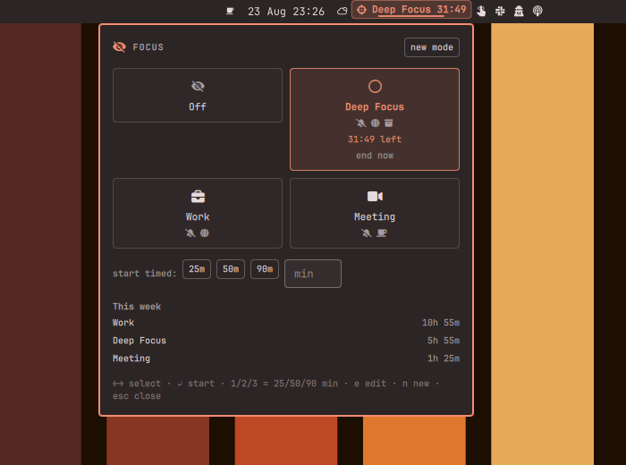

# Focus Modes

**One toggle, whole context.** Work mode blocks the noise; Off mode gives it
back. Like Focus on your phone — but for your actual computer.

A mode is a named profile (Deep Focus, Work, Meeting, your own) that applies a
set of actions *atomically* when it starts and **reverts exactly what it
applied** when it ends — by click, by timer, or after a crash:

- 🔕 **Silence notifications** — the shell's own do-not-disturb
- 🌐 **Block distracting sites** system-wide (`/etc/hosts`, no browser
  extension)
- 📦 **Quarantine distracting apps** — Discord & friends slide to a hidden
  workspace and come back to the exact workspace they were on; apps opened
  mid-mode get caught too
- 🎨 **Switch theme** — visual context for "I'm working now"
- ☕ **Keep the screen awake** (Meeting mode's best friend)
- 🔇 **Mute audio**
- ⚙️ **Run your own hooks** on enter/exit — Slack status, smart lights,
  anything

A timer (25/50/90 min or custom) shows a countdown in the bar; when it
expires everything is restored and you get a notification with the session
length. A small "this week" view totals your focus time per mode.

**Fully local.** No network access, no accounts, no telemetry — your focus
habits never leave the machine.



## Install

```bash
omarchy plugin add https://github.com/Bottelet/omarchy-focus-modes --enable
```

The bar chip shows an outline icon when off, and the mode's icon + name +
remaining time while a mode runs. Click it for the mode cards; keyboard-first
(`←→` select, `↵` start, `1/2/3` = 25/50/90 min timer, `e` edit, `n` new
mode, `Esc` close).

### Site blocking and authorization

Blocking sites edits `/etc/hosts`, which needs root. The first action of a
site-blocking mode runs a tiny audited helper
(`helpers/focus-modes-hosts`) through `pkexec` — polkit shows an
authorization prompt. Cancel it and the mode still applies its other actions;
site blocking is simply skipped (the panel tells you).

`localhost`, `*.local`, `*.localhost` and this machine's own hostname can
never be blocked — local development keeps working no matter what is on the
block list. Already-open tabs keep their existing connections; new lookups
die. See `SECURITY.md` for the full threat model.

**Optional: password-less toggling.** If the per-toggle prompt annoys you,
install the provided polkit rule (edit the username first):

```bash
sudo install -m 644 helpers/49-focus-modes.rules.example /etc/polkit-1/rules.d/49-focus-modes.rules
sudoedit /etc/polkit-1/rules.d/49-focus-modes.rules   # set your username/path
```

## Keybinding

Bind a mode to a key in your Hyprland bindings:

```lua
o.bind("SUPER + SHIFT + F", "Deep Focus",
       "omarchy-shell bottelet.focus-modes activate deep-focus")
```

CLI surface: `activate <mode-id>`, `off`, `status`, `toggle`.

## Editing modes

Click ✎ on a card (or press `e`). Everything is per-mode: the action
toggles, the site list, app classes (with a "pick from open windows" row),
theme, default timer, hooks. Modes live in
`~/.local/state/omarchy-focus-modes/modes.json` if you prefer editing JSON.

## Settings

- **Show mode name** — chip shows icon only when off
- **Scroll cycles modes** — wheel on the chip switches modes (default off)
- **Notify when a timer ends** (default on)

## Good companions, known overlaps

`Curtain` / `Share Cloak` own screen-share hiding — a Meeting mode composes
around them, it doesn't replace them. If you run single-purpose toggles like
`Caffeine` or `Snooze`, they keep working; last writer wins on the shared
resource (idle inhibit, hosts file) and this plugin only ever touches its own
hosts marker block.

## Remove

```bash
omarchy plugin remove bottelet.focus-modes
```

Removal checklist — everything the plugin ever touched:

1. **End the active mode first** (click Off) so DND, theme, mute, windows and
   the hosts block are reverted by the engine itself.
2. If you removed the plugin mid-mode, clean the hosts block manually:
   `sudo /path/to/helpers/focus-modes-hosts --clear` — or delete the block
   between `# >>> bottelet.focus-modes >>>` and
   `# <<< bottelet.focus-modes <<<` in `/etc/hosts` by hand. Verify with
   `grep focus-modes /etc/hosts` (should print nothing).
3. If you installed the optional polkit rule:
   `sudo rm /etc/polkit-1/rules.d/49-focus-modes.rules`
4. State (modes, session log): `rm -rf ~/.local/state/omarchy-focus-modes`

## Dependencies

Everything is on a stock Omarchy install: `bash`, `pkexec` (polkit),
`hyprctl`, `wpctl` (PipeWire), `systemd-inhibit`, `notify-send`,
`resolvectl` (optional, DNS cache flush).

## License

MIT — see `LICENSE`.
